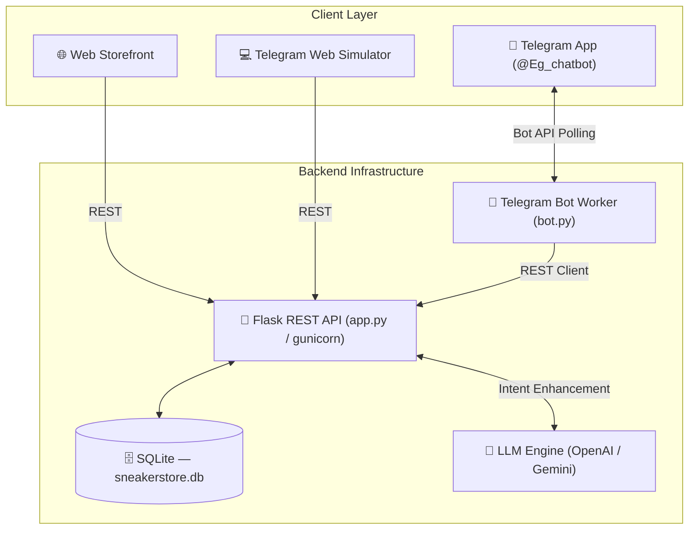
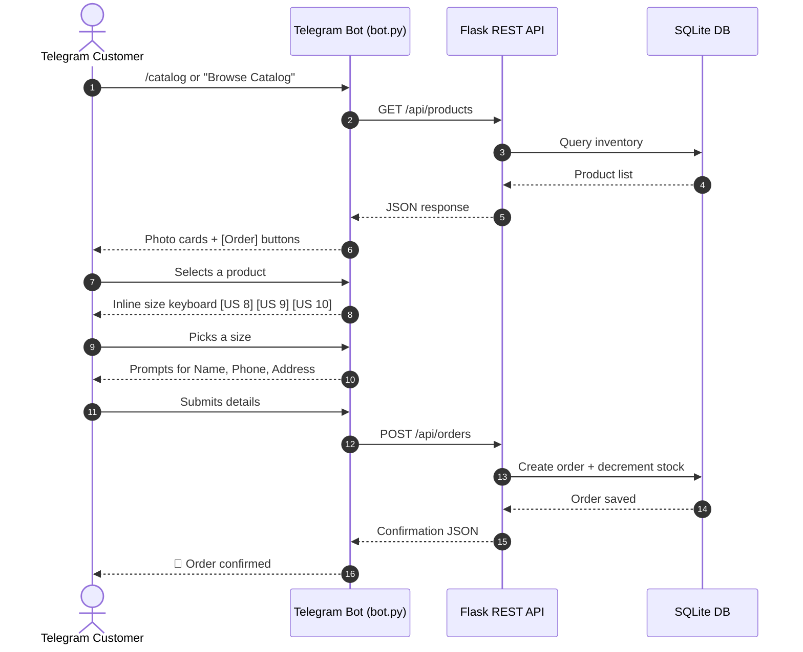

<div align="center">

# 👟 KICKS.AI
### Conversational Commerce for Luxury & Retro Sneakers

**A unified e-commerce ecosystem combining a modern web storefront with a database-grounded AI Telegram concierge.**

[](https://www.python.org/)
[](https://flask.palletsprojects.com/)
[](https://core.telegram.org/bots)
[](https://www.sqlite.org/)
[](https://render.com/)
[](#-license)

[Overview](#-overview) •
[Features](#-features) •
[Architecture](#%EF%B8%8F-architecture) •
[Getting Started](#-getting-started) •
[API Reference](#-api-reference) •
[Deployment](#-deployment) •
[Roadmap](#-roadmap)

</div>

---

## 📖 Overview

**KICKS.AI** bridges a responsive web storefront with an always-on Telegram Assistant (`@Eg_chatbot`) to deliver a seamless, conversational sneaker-shopping experience. Every product answer is **grounded strictly in a live SQLite inventory** — no hallucinated stock, sizes, or prices — and every order, whether placed on the web or in Telegram, is synchronized in real time via the customer's phone number.

| Goal | What it means |
|---|---|
| 🗨️ **Conversational Commerce** | Browse, size-check, and check out entirely inside Telegram |
| 🧠 **Database-Grounded AI** | Product answers are anchored to live inventory — zero hallucination |
| 🔄 **Unified Order Sync** | Orders placed on Web or Telegram merge into one history via phone number |
| ⚡ **1-Click Booking** | Pre-filled checkout details and real-time stock decrementing |
| 🛠️ **Zero-Friction Admin** | Live order notifications and status tracking from `Pending` → `Delivered` |

---

## ✨ Features

<table>
<tr><th>Module</th><th>Capabilities</th><th>Source</th></tr>

<tr>
<td><b>🌐 Web Storefront</b></td>
<td>Responsive glassmorphism UI, brand filter chips, live search, instant 1-click order modal, toast notifications</td>
<td><code>templates/index.html</code><br><code>static/js/app.js</code></td>
</tr>

<tr>
<td><b>🤖 Telegram Bot</b></td>
<td>Live polling, rich photo-card catalog, inline size selector, sizing guide, order tracking</td>
<td><code>bot.py</code></td>
</tr>

<tr>
<td><b>💻 Telegram Web Simulator</b></td>
<td>In-browser preview of the Telegram experience at <code>/telegram</code> with a docked 2×2 keyboard</td>
<td><code>templates/telegram.html</code><br><code>static/js/telegram_sim.js</code></td>
</tr>

<tr>
<td><b>🧠 AI Concierge Engine</b></td>
<td>Natural-language budget parsing (<i>"under $200"</i>), sizing advice, graceful out-of-stock handling</td>
<td><code>app.py</code> → <code>/api/chat</code></td>
</tr>

<tr>
<td><b>📦 Order Management</b></td>
<td>Auto stock decrementing, phone-matched cross-platform lookup, status lifecycle updates</td>
<td><code>app.py</code> → <code>/api/orders</code><br><code>models.py</code></td>
</tr>

<tr>
<td><b>🔐 Unified Auth</b></td>
<td>Single login modal for customers & admins, role-based access, 6-digit reset-code flow</td>
<td><code>templates/login.html</code><br><code>app.py</code> → <code>/api/auth/*</code></td>
</tr>

</table>

---

## 🏗️ Architecture

KICKS.AI follows a **decoupled client–server pattern**: a Flask REST API serves as the single source of truth, while the web UI and Telegram bot worker independently poll and consume it.



### Tech Stack

| Layer | Technology |
|---|---|
| **Frontend** | HTML5, CSS3 (Glassmorphism, CSS Variables), Vanilla JS (ES6) |
| **Backend** | Python 3.9+, Flask, Flask-SQLAlchemy, Flask-CORS |
| **Production Server** | Gunicorn (multi-worker WSGI) |
| **Bot Framework** | `python-telegram-bot` v20.7 (asyncio) |
| **Database** | SQLite (`sneakerstore.db`) |
| **AI / LLM** | OpenAI (`gpt-3.5-turbo`), Google Gemini (`gemini-1.5-flash`) |
| **Cloud Hosting** | Render.com Blueprint / Railway.app |

### Database Schema

| Model | Key Fields | Relationships |
|---|---|---|
| **Product** | `id`, `name`, `brand`, `price`, `stock`, `sizes`, `image_url`, `description` | Referenced by `Order.product_id`; enforces `stock >= quantity` |
| **Order** | `id`, `customer_name`, `customer_phone`, `shipping_address`, `product_id`, `size`, `quantity`, `total_price`, `status`, `source` | FK → `Product`, FK → `User`; indexed by `customer_phone` for cross-platform sync |
| **User** | `id`, `name`, `email` (unique), `password_hash`, `role`, `reset_token` | Has many `Order`s; role-based access (`customer` / `admin`) |

---

## 🔄 How It Works

### Telegram Ordering Flow



### Cross-Platform Order Sync

Every order — web or Telegram — is tagged with `customer_phone`. A lookup against `GET /api/orders?phone=` sanitizes the number (`re.sub(r'\D', '', phone)`) and returns every matching order, giving customers one unified order history regardless of channel.

---

## 🚀 Getting Started

### Prerequisites

- Python 3.9+
- A [Telegram Bot Token](https://core.telegram.org/bots#botfather) from BotFather
- API keys for OpenAI and/or Google Gemini

### Installation

```bash
# Clone the repository
git clone https://github.com/<your-username>/kicks-ai.git
cd kicks-ai

# Create and activate a virtual environment
python -m venv venv
source venv/bin/activate   # Windows: venv\Scripts\activate

# Install dependencies
pip install -r requirements.txt
```

### Environment Variables

Create a `.env` file in the project root:

```env
SECRET_KEY=change_me_to_a_random_secret
TELEGRAM_BOT_TOKEN=your_telegram_bot_token_here
TELEGRAM_BOT_USERNAME=your_bot_username
BACKEND_API_URL=http://localhost:5000/api
OPENAI_API_KEY=your_openai_api_key_here
GEMINI_API_KEY=your_gemini_api_key_here
```

> ⚠️ **Never commit real API keys or bot tokens to version control.** Add `.env` to `.gitignore`, and if a secret has ever been exposed in a doc, chat log, or commit, treat it as compromised and rotate it immediately from the issuing provider's dashboard.

### Run Locally

```bash
# Start the Flask API + web storefront
python app.py

# In a separate terminal, start the Telegram bot worker
python bot.py
```

Visit **`http://localhost:5000`** for the storefront, or message your bot on Telegram.

---

## 📁 Project Structure

```
kicks-ai/
├── app.py                     # Flask REST API & web server
├── bot.py                     # Telegram bot worker
├── models.py                  # SQLAlchemy database models
├── requirements.txt
├── render.yaml                 # Render.com deployment blueprint
├── templates/
│   ├── index.html              # Web storefront
│   ├── telegram.html           # Telegram web simulator
│   └── login.html              # Unified auth modal
├── static/
│   └── js/
│       ├── app.js
│       └── telegram_sim.js
└── sneakerstore.db             # SQLite database
```

---

## 📡 API Reference

| Method | Endpoint | Description |
|---|---|---|
| `GET` | `/api/products` | List all sneakers in inventory |
| `GET` | `/api/products/<id>` | Get details & sizes for a specific product |
| `POST` | `/api/chat` | AI concierge — budget queries, sizing advice |
| `POST` | `/api/orders` | Create an order; decrements stock automatically |
| `GET` | `/api/orders?phone=` | Cross-platform order lookup by phone number |
| `POST` | `/api/auth/login` | Unified customer/admin login |
| `POST` | `/api/auth/reset` | 6-digit code password reset flow |

---

## ☁️ Deployment

KICKS.AI ships with a ready-to-use `render.yaml` blueprint for one-click deployment on **Render.com** (a `web` service for the Flask API and a `worker` service for the Telegram bot).

```yaml
services:
  - type: web
    name: sneaker-store-backend
    env: python
    buildCommand: pip install -r requirements.txt
    startCommand: gunicorn app:app
    envVars:
      - key: SECRET_KEY
        generateValue: true
      - key: TELEGRAM_BOT_TOKEN
        sync: false
      - key: OPENAI_API_KEY
        sync: false
      - key: GEMINI_API_KEY
        sync: false

  - type: worker
    name: sneaker-telegram-bot
    env: python
    buildCommand: pip install -r requirements.txt
    startCommand: python bot.py
    envVars:
      - key: TELEGRAM_BOT_TOKEN
        sync: false
      - key: BACKEND_API_URL
        fromService:
          type: web
          name: sneaker-store-backend
          property: host
          path: /api
```

### Deploy Steps

1. Push this repository to GitHub.
2. Sign in to [Render.com](https://render.com) with GitHub.
3. Click **New +** → **Blueprint**, then select this repo.
4. Fill in the secret environment variables in the Render dashboard (never in the repo).
5. Click **Apply** — Render provisions both the web service and the bot worker automatically.

---

## 🛡️ Security & Reliability

- **Secrets management** — All tokens and keys live in environment variables, never in source or docs.
- **Markdown sanitization** — Dynamic product text passes through an escaping step before being sent to Telegram, preventing entity-parsing crashes.
- **Resilient bot replies** — A safe edit-or-reply fallback prevents `BadRequest: There is no text in the message to edit` errors on photo cards.
- **Concurrency** — Production traffic is served via multi-worker Gunicorn.

---

## 🗺️ Roadmap

- [ ] Multi-currency support
- [ ] Admin analytics dashboard
- [ ] Wishlist & back-in-stock alerts
- [ ] WhatsApp channel integration
- [ ] Automated size-recommendation model

---

## 🤝 Contributing

Contributions are welcome! Please open an issue to discuss significant changes before submitting a pull request.

1. Fork the repository
2. Create a feature branch (`git checkout -b feature/amazing-feature`)
3. Commit your changes
4. Open a pull request

---

## 📄 License

Distributed under the **MIT License**. See `LICENSE` for details.

---

<div align="center">

**KICKS.AI** — Built for sneakerheads, powered by AI. 👟

</div>
